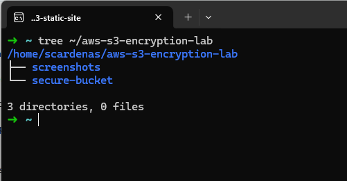
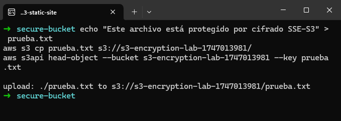
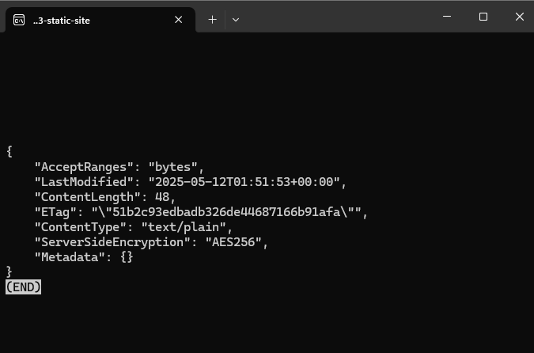
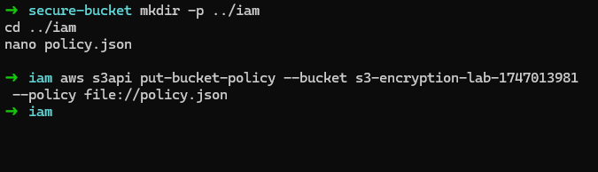
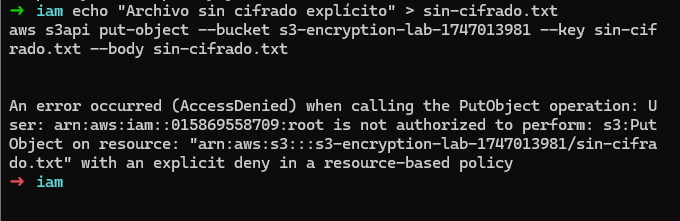
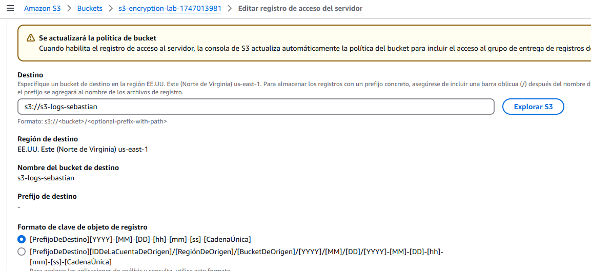
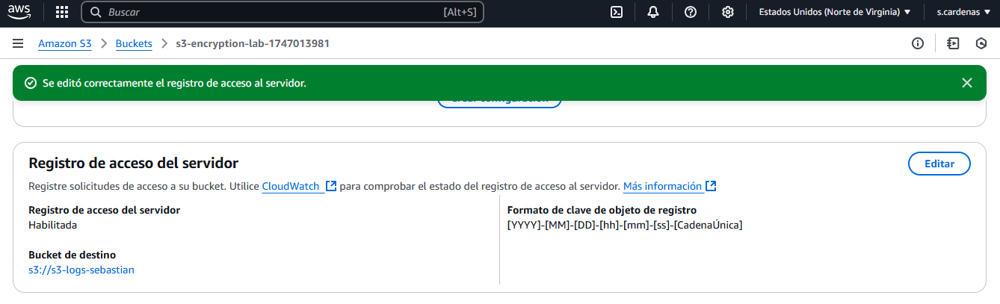

# AWS S3 Encryption & Logging Lab

Este laboratorio consistió en aplicar cifrado del lado del servidor (SSE) a un bucket de Amazon S3 y habilitar los registros de acceso para poder auditar quién entra, desde dónde y en qué momento. Son pasos simples, pero importantes si se quiere manejar datos con un mínimo de criterio de seguridad.

---

## Servicios y herramientas utilizados

* **Amazon S3** — Almacenamiento de objetos y configuración de seguridad
* **AWS CLI** — Interacción mediante línea de comandos
* **IAM Policy** — Políticas para denegar accesos sin cifrado
* **Linux/WSL** — Entorno local de desarrollo
* **Git + GitHub** — Versionado y documentación del laboratorio

---

## Estructura del proyecto

```plaintext
aws-s3-encryption-lab/
├── secure-bucket/              # Archivos de prueba para carga en el bucket
│   └── prueba.txt
├── iam/                        # Política IAM para exigir cifrado
│   └── policy.json
├── screenshots/                # Evidencia visual del laboratorio
│   └── (capturas del proceso)
└── README.md
```

---

## Pasos realizados

1. Crear estructura del proyecto y repositorio local
2. Crear bucket con nombre dinámico desde CLI
3. Verificar cifrado por defecto
4. Crear una policy IAM que deniegue carga sin cifrado SSE
5. Cargar archivo correctamente cifrado (AES256)
6. Intentar cargar sin cifrado y observar bloqueo (AccessDenied)
7. Activar registros de acceso al bucket (logging)

---

## Evidencias del proceso

### 1️⃣ Estructura del proyecto creada



### 2️⃣ Bucket creado con SSE habilitado



### 3️⃣ Verificación del cifrado



### 4️⃣ Política que bloquea carga sin cifrado SSE



### 5️⃣ Carga permitida con cifrado SSE



### 6️⃣ Activación del logging y configuración del destino



### 7️⃣ Confirmación de logs habilitados correctamente



---

Contacto: [sebastian.cardenas.t@gmail.com](mailto:sebastian.cardenas.t@gmail.com)


